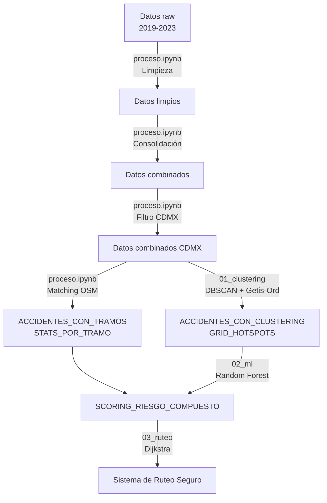

# Documentación de Carpetas de Datos

Este documento explica la estructura y contenido de las **4 carpetas de datos** utilizadas en el proyecto de Ruteo Seguro para CDMX.

---

## 📁 Estructura General

```
ProyectoMineria/
├── Datos raw/                    # Datos originales sin procesar
├── Datos limpios/                # Datos con limpieza básica
├── Datos combinados/             # Datos consolidados (todas las alcaldías)
└── Datos combinados CDMX/        # Datos específicos de CDMX + features engineered
```

---

## 1️⃣ Datos raw/

**📋 Descripción:** Archivos CSV descargados directamente del portal de Datos Abiertos de C5 CDMX, sin ningún procesamiento.

**📂 Estructura:**
```
Datos raw/
├── 2019/
│   └── BASE MUNICIPAL_ACCIDENTES DE TRANSITO GEORREFERENCIADOS_2019.csv
├── 2020/
│   └── BASE MUNICIPAL_ACCIDENTES DE TRANSITO GEORREFERENCIADOS_2020.csv
├── 2021/
│   └── BASE MUNICIPAL_ACCIDENTES DE TRANSITO GEORREFERENCIADOS_2021.csv
├── 2022/
│   └── BASE MUNICIPAL_ACCIDENTES DE TRANSITO GEORREFERENCIADOS_2022.csv
└── 2023/
    └── BASE MUNICIPAL_ACCIDENTES DE TRANSITO GEORREFERENCIADOS_2023.csv
```

**🔧 Generado por:** Descarga manual del portal C5 CDMX

**📊 Características:**
- Un archivo por año (2019-2023)
- Contiene datos de **todas las alcaldías del Estado de México**, no solo CDMX
- Coordenadas geográficas: `latitud`, `longitud`
- Columnas originales del C5:
  - `edo`, `mpio`, `anio`, `mes`, `dia`, `diasemana`, `hora`, `minutos`
  - `urbana`, `suburbana`, `carretera`, `calle1`, `calle2`
  - `nemuerto`, `neherido`, `clase`, `tipaccid`, `automovil`, `campasaj`, etc.

**⚠️ Problemas conocidos:**
- Valores nulos en múltiples columnas
- Inconsistencias en formato de fechas
- Coordenadas (0, 0) o fuera de rango
- Duplicados

**➡️ Procesamiento:** Ver `proceso.ipynb` → Sección "Carga y Limpieza Inicial"

---

## 2️⃣ Datos limpios/

**📋 Descripción:** Datos raw con limpieza básica aplicada (eliminación de nulos, filtrado de coordenadas válidas, corrección de tipos).

**📂 Estructura:**
```
Datos limpios/
├── 2019/
│   └── accidentes_limpios_2019.csv
├── 2020/
│   └── accidentes_limpios_2020.csv
├── 2021/
│   └── accidentes_limpios_2021.csv
├── 2022/
│   └── accidentes_limpios_2022.csv
└── 2023/
    └── accidentes_limpios_2023.csv
```

**🔧 Generado por:** `proceso.ipynb` → Sección "Limpieza y Normalización"

**📊 Mejoras aplicadas:**
- ✅ Eliminación de registros con coordenadas inválidas
- ✅ Filtrado de accidentes con `latitud` y `longitud` no nulas
- ✅ Conversión de tipos de datos (fechas, números)
- ✅ Eliminación de duplicados exactos
- ✅ Normalización de nombres de columnas

**📉 Reducción típica:** ~5-10% de registros eliminados por limpieza

**➡️ Uso:** Base para la consolidación en `Datos combinados/`

---

## 3️⃣ Datos combinados/

**📋 Descripción:** Consolidación de datos limpios de **todos los años y todas las alcaldías** (2019-2023 y 2022-2023).

**📂 Archivos:**
```
Datos combinados/
├── ACCIDENTES_COMBINADO_2019_2023.csv    # 5 años consolidados (2019-2023)
└── ACCIDENTES_COMBINADO_2022_2023.csv     # 2 años recientes (2022-2023)
```

**🔧 Generado por:** `proceso.ipynb` → Sección "Consolidación Temporal"

**📊 Contenido:**
- **ACCIDENTES_COMBINADO_2019_2023.csv**:
  - ~240,000 registros (aprox.)
  - Todas las alcaldías del Estado de México + CDMX
  - Periodo: 1 de enero 2019 - 31 de diciembre 2023

- **ACCIDENTES_COMBINADO_2022_2023.csv**:
  - ~95,000 registros (aprox.)
  - Datos más recientes para análisis actualizados
  - Periodo: 1 de enero 2022 - 31 de diciembre 2023

**📋 Columnas principales:**
- Todas las columnas originales del C5
- `fechahora` (timestamp consolidado)
- `anio`, `mes`, `dia`, `diasemana`, `hora`, `minutos`
- `latitud`, `longitud`
- Variables categóricas: `urbana`, `clase`, `tipaccid`
- Conteos: `nemuerto`, `neherido`, `automovil`, `campasaj`, etc.

**➡️ Uso:** Filtrado para obtener solo registros de CDMX → `Datos combinados CDMX/`

---

## 4️⃣ Datos combinados CDMX/ ⭐

**📋 Descripción:** Datos filtrados exclusivamente para **Ciudad de México** (alcaldías de CDMX), con **feature engineering** aplicado y análisis espacial/ML completado.

**📂 Archivos:**

### 📄 Archivos Base (generados por `proceso.ipynb`):

```
ACCIDENTES_COMBINADO_CDMX_2019_2023.csv
```
- **Registros:** ~78,000 accidentes
- **Filtro:** Solo CDMX (edo == 9 y mpio en [2,3,4,5,6,7,8,9,10,11,12,13,14,15,16,17])
- **Features agregadas:**
  - `franja_horaria`: Madrugada, Mañana, Tarde, Noche
  - `es_fin_de_semana`: Boolean
  - `es_hora_pico`: Boolean (7-10am, 2-4pm, 6-9pm)
  - `gravedad`: Clasificación binaria (grave si nemuerto > 0 o neherido >= 3)

```
ACCIDENTES_COMBINADO_CDMX_2022_2023.csv
```
- **Registros:** ~32,000 accidentes
- **Periodo:** 2022-2023 (datos recientes)
- Mismas features que el archivo 2019-2023

### 📄 Archivos con Matching a Red Vial (generados por `proceso.ipynb`):

```
ACCIDENTES_CON_TRAMOS_2019_2023.csv
```
- **Registros:** ~32,139 accidentes (con matching exitoso)
- **Nuevas columnas:**
  - `edge_u`, `edge_v`, `edge_key`: IDs de los edges del grafo OSM
  - `distancia_edge`: Distancia al edge más cercano (metros)

```
STATS_POR_TRAMO_2019_2023.csv
```
- **Registros:** ~14,982 tramos (edges únicos)
- **Agregaciones por tramo:**
  - `accidentes_totales`: Conteo de accidentes
  - `severidad_total`: Suma de gravedad
  - `muertos_totales`: Total de fallecidos
  - `heridos_totales`: Total de heridos
  - `accidentes_graves`: Accidentes con muertos o heridos graves
  - `distancia_prom_edge`: Distancia promedio al edge

**🎯 Uso:** Asignación de **riesgo histórico** a calles (60% del índice compuesto)

### 📄 Archivos con Clustering (generados por `01_analisis_espacial_clustering.ipynb`):

```
ACCIDENTES_CON_CLUSTERING.csv
```
- **Registros:** ~32,139 puntos
- **Algoritmo:** DBSCAN (eps=200m, min_samples=20)
- **Nuevas columnas:**
  - `cluster_dbscan`: ID del cluster (-1 = ruido)
  - `riesgo_cluster`: Índice de riesgo basado en clustering (0-100)

**🔬 Resultados DBSCAN:**
- **299 clusters** identificados
- **17,178 puntos** en clusters (53.4%)
- **14,961 puntos** como ruido (46.6%)

```
GRID_HOTSPOTS.csv
```
- **Registros:** ~755 celdas con accidentes
- **Tamaño celda:** 0.01° (~1.1 km)
- **Análisis:** Getis-Ord Gi* para hot spots
- **Columnas:**
  - `centroid_lat`, `centroid_lon`: Centro de la celda
  - `n_accidentes`: Conteo de accidentes en la celda
  - `gi_score`: Z-score de Getis-Ord Gi*
  - `hot_spot`: Clasificación (Hot Spot 99%, 95%, No significativo, Cold Spot)
  - `riesgo_hotspot`: Índice de riesgo (0-100)

**📊 Distribución Hot Spots:**
- **725 celdas:** No significativas
- **17 celdas:** Hot Spot 95%
- **13 celdas:** Hot Spot 99%

**🎯 Uso:** Asignación de **riesgo espacial/clustering** a calles (10% del índice compuesto)

### 📄 Archivo con Scoring ML (generado por `02_modelado_ml_causas.ipynb`):

```
SCORING_RIESGO_COMPUESTO.csv
```
- **Registros:** ~72,131 puntos
- **Modelos aplicados:** Random Forest, Decision Tree, Logistic Regression, Stacking Ensemble
- **Columnas:**
  - `latitud`, `longitud`: Coordenadas
  - `riesgo_cluster`: Riesgo de clustering (heredado de ACCIDENTES_CON_CLUSTERING)
  - `riesgo_ml`: Probabilidad de accidente grave × 100 (0-100)
  - `indice_riesgo_compuesto`: **Índice final compuesto** (0-100)

**📐 Fórmula del índice compuesto:**
```
riesgo_compuesto = 0.6 × riesgo_histórico + 0.1 × riesgo_cluster + 0.3 × riesgo_ml
```

**🎯 Uso:** Asignación de **riesgo ML** (30%) y **riesgo final compuesto** a calles para el sistema de ruteo

---

## 🔄 Flujo de Datos Completo



---

## 📊 Resumen de Tamaños

| Carpeta | Archivos | Registros Totales (aprox.) |
|---------|----------|---------------------------|
| **Datos raw/** | 5 CSV (2019-2023) | ~240,000 |
| **Datos limpios/** | 5 CSV (2019-2023) | ~228,000 |
| **Datos combinados/** | 2 CSV | ~240,000 (consolidado) + ~95,000 (2022-2023) |
| **Datos combinados CDMX/** | 7 CSV | ~78,000 (base) + derivados |

---

## 🎯 Archivos Clave para Reproducibilidad

Si deseas **reproducir el análisis completo**, asegúrate de ejecutar los notebooks en este orden:

1. **`proceso.ipynb`** → Genera:
   - `Datos limpios/`
   - `Datos combinados/`
   - `Datos combinados CDMX/ACCIDENTES_COMBINADO_CDMX_*.csv`
   - `Datos combinados CDMX/ACCIDENTES_CON_TRAMOS_2019_2023.csv`
   - `Datos combinados CDMX/STATS_POR_TRAMO_2019_2023.csv`

2. **`01_analisis_espacial_clustering.ipynb`** → Genera:
   - `Datos combinados CDMX/ACCIDENTES_CON_CLUSTERING.csv`
   - `Datos combinados CDMX/GRID_HOTSPOTS.csv`

3. **`02_modelado_ml_causas.ipynb`** → Genera:
   - `Datos combinados CDMX/SCORING_RIESGO_COMPUESTO.csv`

4. **`03_sistema_ruteo_zocalo_polanco.ipynb`** → Usa todos los archivos anteriores para calcular rutas seguras

---

## ⚠️ Notas Importantes

- **NO MODIFIQUES** los archivos en `Datos raw/` - son la fuente original
- Los archivos en `Datos combinados CDMX/` son **regenerables** ejecutando los notebooks en orden
- El archivo `SCORING_RIESGO_COMPUESTO.csv` es el **más importante** para el sistema de ruteo (contiene el índice final)
- Si falta algún archivo, ejecuta el notebook correspondiente según el flujo de datos

---

## 📞 Contacto

Para preguntas sobre la estructura de datos, consulta:
- [`docs/README_NOTEBOOKS.md`](README_NOTEBOOKS.md) - Flujo de ejecución de notebooks
- [`docs/README_FORMULAS.ipynb`](README_FORMULAS.ipynb) - Fórmulas matemáticas detalladas
